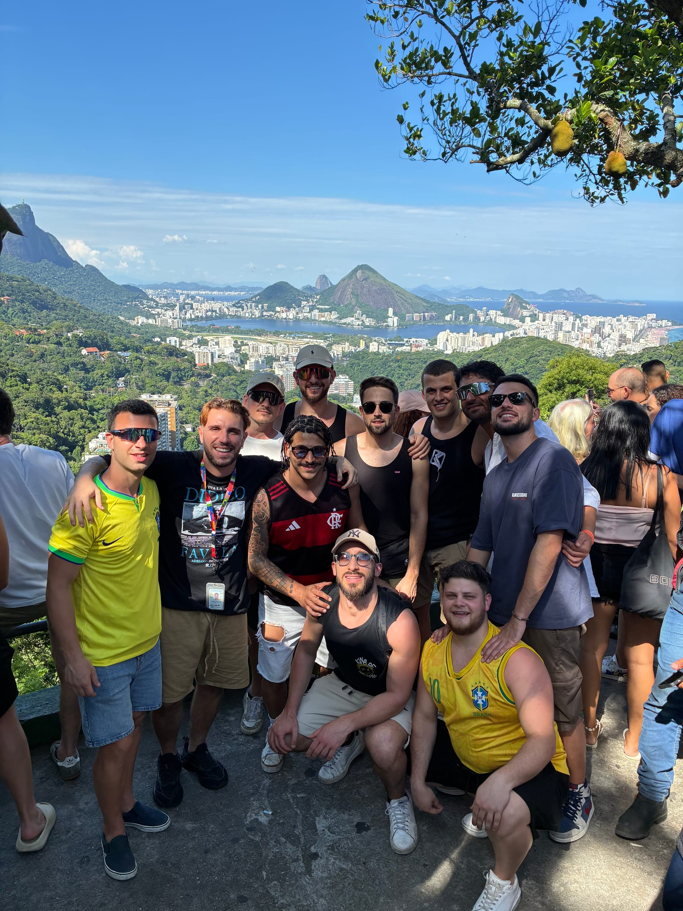

You do not "look at" Rocinha: you cross it. It is Brazil's largest favela — a
city within the city, leaning on the mountain above São Conrado — and the
right way to visit it is the way of the people who live there: ride up, walk
down.

## It starts with the engines

We warm up the engines right away, hopping on the bikes of the local mototaxi
riders: in a few minutes we are at the top, where the view opens onto Christ
the Redeemer, the Lagoa, Sugarloaf and the beaches of Leblon and Ipanema. From
there the walk down begins, slowly, into the real life of the community.

On the way we step into a local family's home, visit the gallery of a graffiti
artist born and raised here, pass the pitch rebuilt by a footballer from
Rocinha who made it to Europe, and close with an Italian NGO that has worked
in the community for more than 20 years.

> You are not joining a simple tour: it is an experience you live to the full.

## The numbers

- **3 hours**, from the top down.
- **Max 19 people** — small groups, human pace.
- **R$270 per person** (children up to 12: R$180), mototaxi and visitation fee included.
- **Mon–Fri 11:00 and 15:30 · Sat–Sun 09:00 and 14:00.**
- **Meeting point:** Av. Niemeyer 780, São Conrado.

One rule I always explain: in the first alley, no photos and no sunglasses —
the rest I will tell you along the way.
[Book the Rocinha Favela Tour](../../tour/favela-tour-rocinha/) — or message
me on Instagram for dates and availability.
