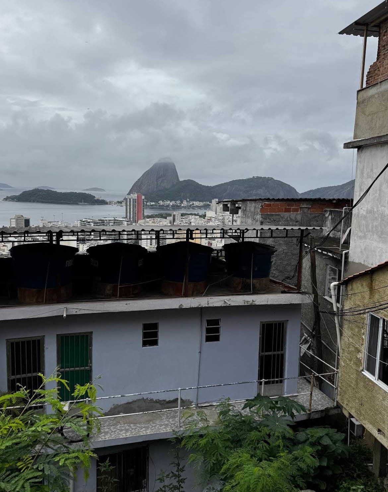
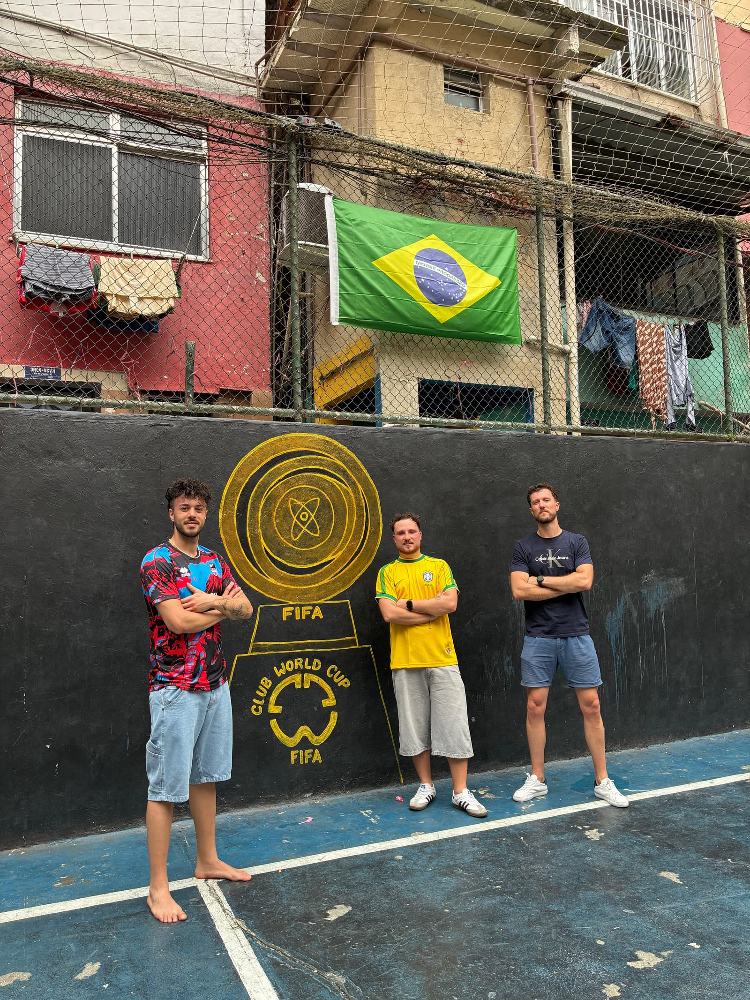

There is a favela where I take even first-time visitors to Rio without
thinking twice: Tavares Bastos, perched above Catete, steps from downtown. It
is considered the most laid-back, relaxed community in the city centre — and
one of the most surprising.

## A pitch you already know

We warm up the engines with the mototaxis to the top, then walk down through
the alleys, the family life and the local shops. And at some point we step
out onto the FIFA Street football pitch — yes, the one from the video game. A
match is mandatory: a kickabout with the neighbourhood kids is worth more
than a thousand photos.

From the high points the view opens over downtown and Guanabara Bay, from an
angle almost no tourist knows.

> I will turn your dream into reality — in Tavares Bastos I truly believe it.

## The numbers

- **2 hours 30** of tour.
- **Min 2 · max 20 people.**
- **R$270 per person**, mototaxi included.
- **Every day, 10:00 and 14:00.**
- **Meeting point:** Rua Bento Lisboa 72, Catete.

[Book the Tavares Bastos Favela Tour](../../tour/favela-tour-tavares-bastos/)
— or message me on Instagram and I will tell you why it is my secret tip.
