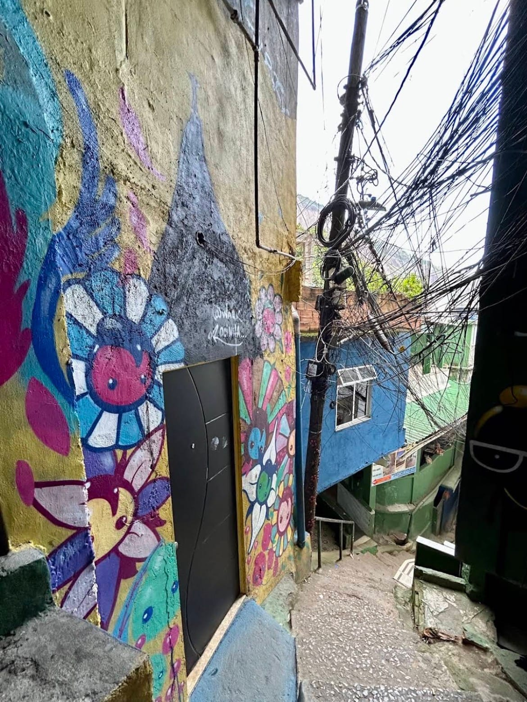
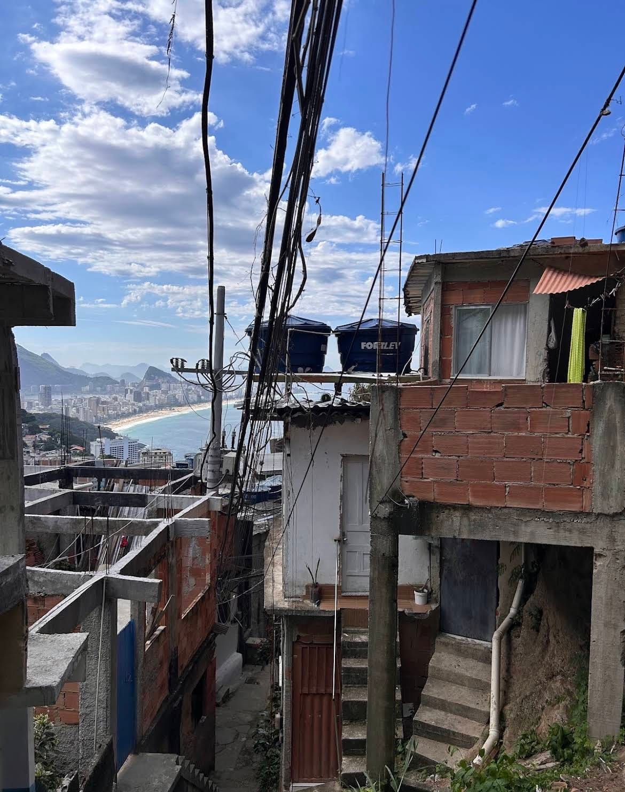

It is the first question everyone asks me, and it is the right one: **is it
safe to visit a favela?** The honest answer is yes — if you enter with someone
the community knows, and if you enter with respect. I live in Vidigal, and in
the communities we visit we are not standing in front of the city: we are
inside it.

## How a tour with me works

We warm up the engines right away, hopping on the bikes of the local mototaxi
riders: they are the first reason the tour is safe. Riding up with the
community's own guys means arriving as guests, not strangers. Then we walk
down, slowly, into the real life of the community.

There are two simple rules I always explain before we set off: in some alleys
**no photos**, and sunglasses stay in your pocket — here, looking people in
the eye matters. The rest is walking, greeting, listening.

> You will see things you cannot film with your phone, but you will remember
> them for the rest of your life.

## The numbers

- **9 years**: how long I have lived in Rio de Janeiro.
- **Max 19–20 people**: groups stay small, always.
- **R$270 per person**: the same price for every favela tour, mototaxi always included.
- **3 languages**: I tell the story in English, Italian and Portuguese.

If you want to see it for yourself, tours run every day:
[discover the Rocinha Favela Tour](../../tour/favela-tour-rocinha/) — or
message me on Instagram and we will pick the right one together.
