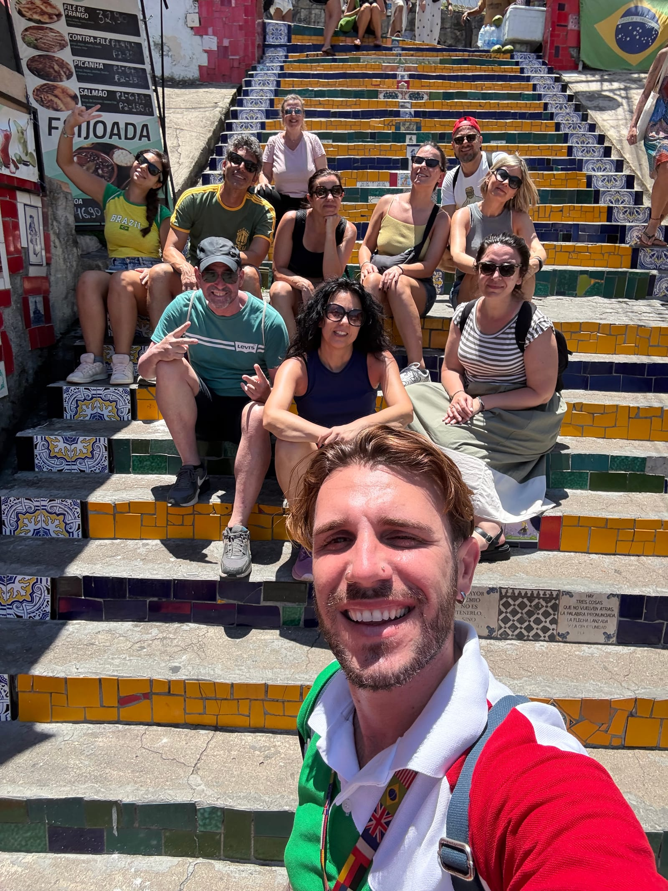

Avete un solo giorno a Rio? Si può fare — e bene. «Un Giorno a Rio» è
l’itinerario che ho costruito per scoprire — o bere, come si dice qui — il
succo della Cidade Maravilhosa in otto ore, con auto o van privato con autista
e pick-up direttamente in hotel.

## L’itinerario

1. **Cristo Redentore** — si sale con il trenino del Corcovado, 20 minuti
   dentro la foresta, fino all’abbraccio di una delle 7 meraviglie del mondo
   moderno e alla vista a 360° sulla città.
2. **Santa Teresa** — il quartiere bohémien: case storiche, botteghe, graffiti
   e il Largo dos Guimarães.
3. **Scalinata Selarón** — la storia dello stravagante artista che l’ha
   ricoperta di piastrelle arrivate da tutto il mondo.
4. **Pan di Zucchero** — la funivia da Praia Vermelha via Morro da Urca:
   davanti il Cristo, la baia di Guanabara e Copacabana da un’angolazione
   degna di un quadro.

In mezzo, un pranzo a buffet con calma — incluso, bevande escluse. Con il
pranzo la giornata arriva a 9 ore.

> In una giornata scoprirete — o berrete, come si dice qui — il succo di Rio.

## I numeri

- **8 ore** di tour (9 con il pranzo), tutti i giorni dalle 08:00.
- **Da 2 a 15 persone**: da R$780 a persona in base al gruppo.
- **Inclusi:** auto o van privato con autista, trenino del Corcovado, funivia
  del Pan di Zucchero, pranzo a buffet.
- **Pick-up in hotel**, ovunque a Rio.
- **Prenotate con 5–7 giorni di anticipo.**

[Scoprite Un Giorno a Rio](../../tour/un-giorno-a-rio/) — e se siete più di 6,
il prezzo a persona scende: scrivetemi e facciamo i conti insieme.
