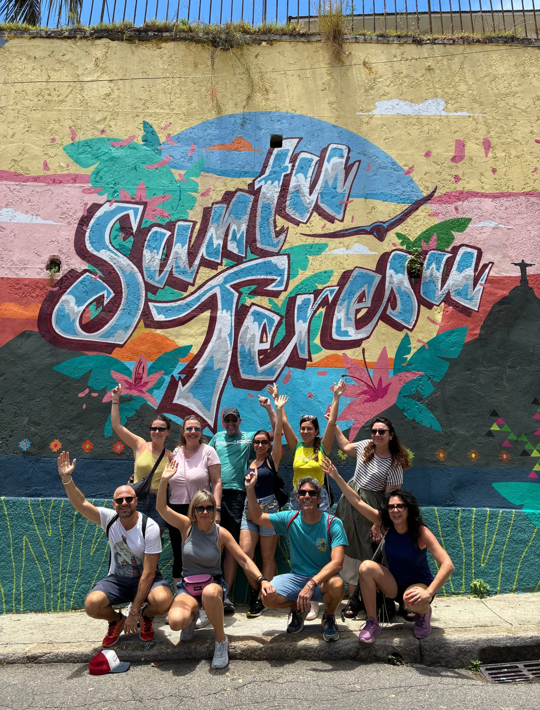

Qualche tempo fa il magazine italiano **Voglio Vivere Così** — quello che
racconta le storie di chi decide di cambiare vita e partire — mi ha
intervistato. Il titolo che hanno scelto dice tutto meglio di come potrei dirlo
io: *«In Brasile c’è amore per la vita»*.

È esattamente quello che ho trovato qui. Sono partito dalla provincia di Milano,
sono arrivato in Brasile nel 2017 quasi per caso — un progetto di volontariato —
e non sono più tornato indietro. Oggi vivo al Vidigal, la favela affacciata sul
mare tra Leblon e i Dois Irmãos, e da nove anni faccio la guida qui a Rio de
Janeiro.

## Perché ne parlo qui

Perché è il cuore di Vidapiena. «Vita piena» non è uno slogan: è il motivo per
cui accompagno le persone *dentro* le comunità, non davanti. Nell’intervista
raccontavo una cosa semplice: in Italia il mio vicino di casa non mi salutava;
qui il quartiere organizza una festa al mese per i compleanni. Questa è la Rio
che voglio farti vedere — non dal finestrino chiuso di una macchina, ma a piedi,
salutando le persone che incontriamo.

> La differenza tra vedere Rio e viverla è tutta qui: entrare da ospiti, con
> rispetto, dove la vita succede davvero.

## Vieni a viverla di persona

Se questa storia ti ha incuriosito, il passo successivo è semplice:
[leggi l’intervista completa su Voglio Vivere Così](https://www.voglioviverecosi.com/francesco-brasile.html)
e poi vieni a camminare con me. Il
[Favela Tour Vidigal](../../tour/favela-tour-vidigal/) parte proprio dalla
comunità dove vivo: mototaxi in salita, discesa tra i vicoli e gran finale con
vista sul Cristo Redentore.

Scrivimi su [Instagram](https://www.instagram.com/vidapiena/) o su WhatsApp e
scegliamo insieme il tour giusto per te. Ci vediamo a Rio.
