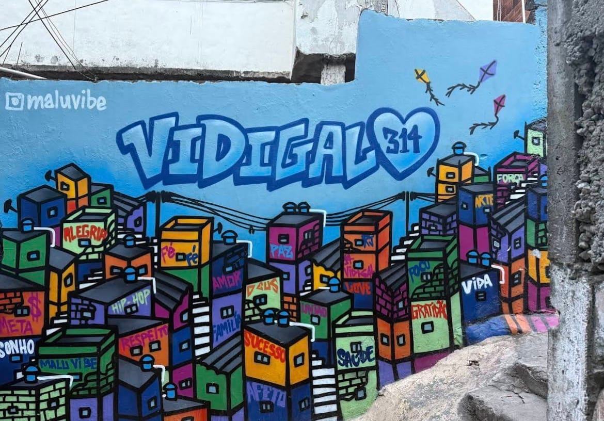
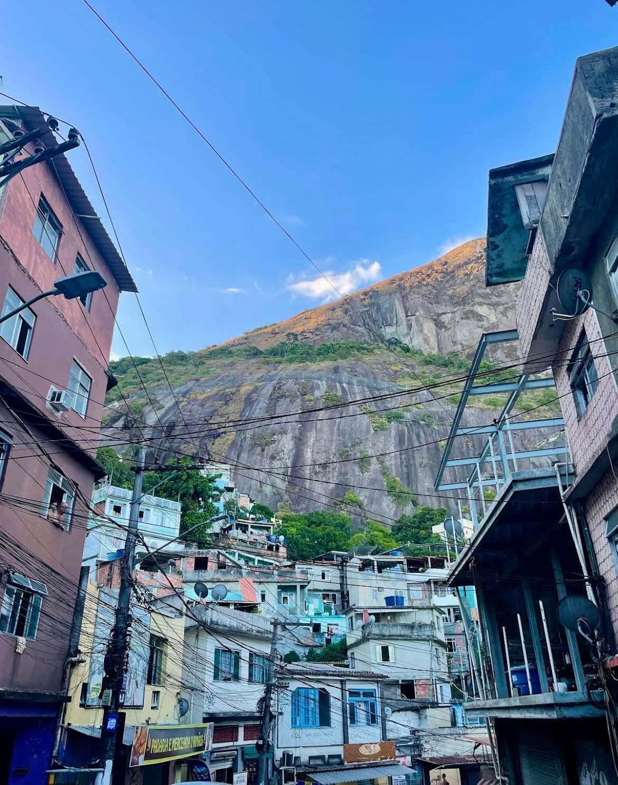

Il Vidigal è casa mia: la favela affacciata sul mare, stretta tra Leblon e la
pietra dei Dois Irmãos. Ed è il posto dove porto chi vuole capire perché ho
scelto Rio — soprattutto nel tardo pomeriggio, quando la luce si abbassa e la
città si accende.

## Come si arriva

Si parte dalla Praça do Vidigal, l’ingresso della comunità. Da lì scaldiamo
subito i motori: i mototaxi dei ragazzi locali ci portano fino alla parte
alta, riqualificata, con il campetto e il parco. Nei giorni feriali il tour
del pomeriggio parte alle 15:30 — i tempi giusti per arrivare in alto con la
luce buona.

## Dove guardare

Nella parte alta ci fermiamo in un bar con una delle viste più belle della
città: Leblon, Ipanema e il Pan di Zucchero in un’unica inquadratura. Poi si
scende a piedi, vicolo per vicolo, fermandoci dove la vita succede. Il gran
finale è una terrazza panoramica con vista sul Cristo Redentore.

> Vivo qui: passo da vicoli dove passano solo i locali, e voi con me.

## I numeri

- **2 ore e 30** di tour, in discesa.
- **Min 2 · max 19 persone.**
- **R$270 a persona**, mototaxi e tassa di visita inclusi.
- **Lun–ven 09:00 e 15:30 · sab–dom 09:00 e 14:00.**
- **Punto d’incontro:** Praça do Vidigal.

[Prenotate il Favela Tour del Vidigal](../../tour/favela-tour-vidigal/) — e se
volete il tramonto, scrivetemi su Instagram: scegliamo insieme l’orario giusto
per la stagione.
